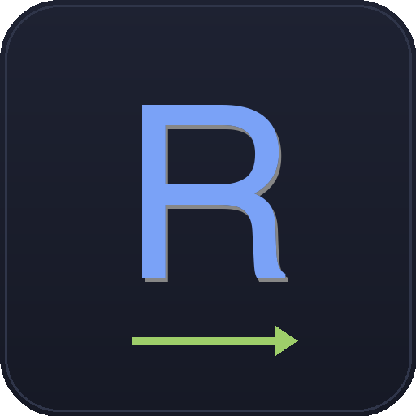

<h1 align="center">
  <br>
  <a href="https://chud-lori.github.io/rusty-requester/"></a>
  <br>
  Rusty Requester
  <br>
</h1>

<h4 align="center">A native, offline API client built with Rust and <code>egui</code>. One binary, no bundled browser, no account.</h4>

<p align="center">
  <b>Rust + egui, no webview</b> · <b>local JSON workspace</b> · <b>no account, no telemetry</b>
</p>

<p align="center">
  <a href="https://www.rust-lang.org"></a>
  <a href="https://github.com/chud-lori/rusty-requester/actions/workflows/ci.yml"></a>
  <a href="./LICENSE"></a>
  <a href="#-install"></a>
  <a href="https://github.com/chud-lori/rusty-requester/releases/latest"></a>
  <a href="https://github.com/chud-lori/rusty-requester/releases"></a>
  <a href="https://github.com/chud-lori/rusty-requester/issues"></a>
</p>

<p align="center">
  <a href="docs/FEATURES.md">Features</a> •
  <a href="CHANGELOG.md">What's new</a> •
  <a href="https://chud-lori.github.io/rusty-requester/">Documentation</a> •
  <a href="#-contributing">Contributing</a> •
  <a href="https://github.com/chud-lori/rusty-requester/issues/new">Report Issues</a>
</p>

---

- [Why Rusty Requester?](#-why-rusty-requester)
  - [How it differs](#how-it-differs)
  - [Why Rust for an API client?](#why-rust-for-an-api-client)
  - [Highlights](#highlights)
- [Security](#-security)
- [Install](#-install)
  - [One-line install (macOS + Linux)](#one-line-install-macos--linux)
  - [Manual install](#manual-install)
  - [First launch on macOS (Gatekeeper)](#first-launch-on-macos-gatekeeper)
  - [Uninstall](#uninstall)
  - [Build from source](#build-from-source)
- [Quickstart](#-quickstart)
  - [Useful shortcuts](#useful-shortcuts)
  - [Collection Runner](#collection-runner)
- [Compatibility & stability](#-compatibility--stability)
- [Docs](#-docs)
- [Contributing](#-contributing)
- [License](#-license)
- [Contact](#-contact)

---

## 🎯 Why Rusty Requester?

*Why "Rusty"?* It's a double pun on **Rust** (the language) and
**rust-as-in-old-stuff-that-still-works**. Plenty of developers are on
older or low-spec machines that can't stomach a desktop app which
ships a browser engine, so this is built for them first.

Most API clients today are Electron apps: Chromium and Node wrapped
around a form builder. That buys cross-platform consistency at the cost
of carrying a browser runtime in every install. Rusty Requester is a
single native binary that draws its own interface through `egui`. No
webview, no Node, no account.

### How it differs

Rather than assert numbers about other people's software, here is what
this one does, all of it checkable in this repository:

| | Rusty Requester |
|---|---|
| Runtime | Rust + `egui`, drawn natively. No webview, no Node, no helper processes. |
| Account | None. There is no sign-in and no server side. |
| Telemetry | None. The only outbound traffic is your requests, plus one optional update check you can switch off. |
| Storage | A local `data.json`, plus optional reviewable `.rr` request files you can keep in Git. |
| Response HTML | Rendered as markup in `egui`. No DOM, no JavaScript engine. |
| Dependencies | 561 package entries in `Cargo.lock`. Verify with `grep -c '^\[\[package\]\]' Cargo.lock`. |

Bruno is the closest match in spirit: offline, file-based, open source.
It is a good product. The difference is the runtime.

> Earlier versions of this readme carried a side-by-side table of
> download sizes, idle RAM, cold-start times and npm dependency counts
> for Postman, Insomnia and Bruno. None of those figures had a recorded
> source, so they have been removed. If they get measured properly, the
> table can come back with the method attached.

### Why Rust for an API client?

- **Memory safety.** A malformed response can't buffer-overflow the
  parser the way a C client could. Rust's bounds checks and
  borrow-checker eliminate a whole class of CVE.
- **No JS runtime means no JS CVEs.** Response HTML renders as markup
  in `egui`, not in a Chromium webview. A hostile server can't hit you
  with a V8 exploit because there is no V8.
- **A dependency tree you can count.** `Cargo.lock` pins 561 package
  entries, and that figure includes the app itself plus every
  platform-specific and build-time crate, so any one target compiles
  fewer. Fewer transitive dependencies means fewer places for a
  supply-chain compromise to land.
- **Well-audited networking.** `reqwest` + `rustls` (or `native-tls`)
  handle TLS and redirects. Both are heavily used across the Rust
  ecosystem.
- **Honest caveat.** Rust isn't magically safe from supply-chain
  attacks. We mitigate with `Cargo.lock` pinning, sticking to
  widely-used crates (`reqwest`, `tokio`, `serde`, `egui`), and
  running `cargo audit` before every release. A compromised upstream
  would still bite us.

### Highlights

Tabbed request editor, per-environment variables + cookie jar,
Postman Collection v2.1 import, syntax-highlighted JSON (with
Postman-style fold chevrons on every `{` / `[`) / Tree / HTML / SSE
views, **Server-Sent Events streaming** for LLM APIs, **Cancel**
mid-flight, **Response diff** across sends, **Collection Runner** with
CSV/JSON data rows, presets, detail drilldowns, scoped runs, safe
CSV/HTML reports, redacted code snippets, Git-friendly workspace
exports, file-backed collection folders with readable `.rr` request files,
status/diff review, pull/commit/push through your local Git credentials,
OpenAPI refresh, request finder + actions palette (`Cmd` on macOS,
`Ctrl` on Linux/Windows), and platform menus. Full catalog in
[`docs/FEATURES.md`](docs/FEATURES.md) and the usage guide in
[`docs/usage.html`](docs/usage.html).

---

## 🔐 Security

An API client lives on a trust boundary. You type a URL, a stranger's
server sends bytes back. The headline guarantees:

- **No auto-download, no code execution on response content.** Saving
  goes through the OS dialog, HTML renders as markup (no DOM, no JS
  engine), and `<script>` tags display as text.
- **No memory-corruption path.** TLS and HTTP go through
  `reqwest`, `hyper` and `rustls`, all safe Rust. No C-client
  buffer-overflow class of CVE.
- **No shell execution on `curl` paste.** Flags are parsed as data,
  never `exec`'d.
- **Secret-aware sharing.** Code snippets are redacted by default, and
  collection exports can be scanned locally before writing files.

You still own: SSRF from your own machine (`localhost`, internal IPs),
files you explicitly save and then open in a vulnerable downstream app,
and plaintext local data under your home directory or collection Git folders.
App data stays local. Workspace backups are written `0600` inside a `0700`
directory; `data.json` itself is created with whatever mode your umask gives
it, so check that if your umask is permissive. Collection exports mask secrets
by default, but a private repo is access control, not encryption. Full threat
model and vulnerability reporting in
[`SECURITY.md`](./SECURITY.md).

---

## 📥 Install

### One-line install (macOS + Linux)

```bash
curl -fsSL https://raw.githubusercontent.com/chud-lori/rusty-requester/main/install.sh | bash
```

The installer auto-detects your platform and pulls the matching release
asset:

- **macOS** (universal, Apple Silicon and Intel): `RustyRequester-vX.Y.Z-macos-universal.dmg`.
  Copies `RustyRequester.app` into `/Applications` (falls back to
  `~/Applications` if the system folder isn't writable), quits any
  running instance, strips the Gatekeeper quarantine attribute, and
  re-registers with Launch Services so Dock / Spotlight pick up the
  new bundle.
- **Linux** (x86_64 glibc 2.35+, so Ubuntu 22.04, Debian 12,
  Fedora 36+, RHEL 9 and newer):
  `RustyRequester-vX.Y.Z-linux-x86_64.tar.gz`. Installs the binary
  directly at `~/.local/bin/rusty-requester`, drops a `.desktop`
  entry into `~/.local/share/applications`, and puts icons in both
  `hicolor/512x512/apps/` and `pixmaps/`. User data lives
  separately at `~/.local/share/rusty-requester/data.json` so the
  two never get tangled. No `sudo`. If `~/.local/bin` isn't on your
  `PATH`, the script tells you how to add it.

No Windows build is published and the installer refuses to run there.
The source carries Windows branches, so `cargo build --release` is the
only route on Windows today. Linux on ARM is not built either; the
installer says so and points at building from source.

Install a specific version:

```bash
curl -fsSL https://raw.githubusercontent.com/chud-lori/rusty-requester/main/install.sh | VERSION=v0.3.0 bash
```

macOS: keep the Gatekeeper quarantine attribute (you'll do the
"right-click → Open" dance yourself on first launch):

```bash
curl -fsSL https://raw.githubusercontent.com/chud-lori/rusty-requester/main/install.sh | SKIP_QUARANTINE_STRIP=1 bash
```

After it finishes, launch:

```bash
open /Applications/RustyRequester.app     # macOS
rusty-requester                           # Linux (if ~/.local/bin on PATH)
```

### Manual install

**macOS**: grab `RustyRequester-vX.Y.Z-macos-universal.dmg` from the
[Releases page](https://github.com/chud-lori/rusty-requester/releases/latest),
open the `.dmg`, drag **`RustyRequester.app`** onto the **`Applications`**
shortcut, eject the disk image.

**Linux** (x86_64 glibc): grab `RustyRequester-vX.Y.Z-linux-x86_64.tar.gz`,
extract it, run `./install-local.sh` inside, then `rusty-requester`
(ensure `~/.local/bin` is on your `PATH`).

### First launch on macOS (Gatekeeper)

The app isn't notarised by Apple (no paid developer account), so macOS
will refuse to open it on the first launch with *"can't be opened
because Apple cannot check it for malicious software"*, **unless you
installed with the one-liner above**, which auto-strips the quarantine
flag.

If you used the manual install, work around it once:

- **Right-click** the app → **Open** → confirm in the dialog, **OR**
- **System Settings → Privacy & Security**, scroll down, and click
  **"Open Anyway"** next to the Rusty Requester entry

You only need to do this once.

### Uninstall

The same one-liner in `UNINSTALL=1` mode removes the app and
preserves your `data.json` (collections, history, OAuth tokens):

```bash
curl -fsSL https://raw.githubusercontent.com/chud-lori/rusty-requester/main/install.sh | UNINSTALL=1 bash
```

Add `PURGE=1` to wipe user data too:

```bash
curl -fsSL https://raw.githubusercontent.com/chud-lori/rusty-requester/main/install.sh | UNINSTALL=1 PURGE=1 bash
```

Or, if you still have the extracted Linux tarball around, run
`./uninstall-local.sh` (pass `--purge` to also delete data). macOS:
the one-liner removes `RustyRequester.app` from `/Applications`
(or `~/Applications`), quits any running instance, and, with
`PURGE=1`, clears `~/Library/Application Support/rusty-requester`.

### Build from source

```bash
git clone https://github.com/chud-lori/rusty-requester
cd rusty-requester

make run        # debug build + run
make release    # optimized binary at target/release/rusty-requester
make app        # build a macOS .app bundle (in target/bundle/)
make app-install  # build the bundle and copy it to /Applications
make help       # list all targets
```

Or use Cargo directly: `cargo run`, `cargo build --release`, `cargo test`.
Requires **Rust 1.73+**, installed via [rustup.rs](https://rustup.rs).

---

## 🚀 Quickstart

1. Click **➕ New Collection** in the sidebar.
2. Inside the collection, click **➕ Request**.
3. Pick a method, enter a URL (or paste a `curl` command instead, which auto-fills method, headers, body and auth).
4. Click **Send** (or press **⌘/Ctrl + Enter**).

All edits auto-save to a single local JSON file. Nothing leaves your machine:

- **macOS:** `~/Library/Application Support/rusty-requester/data.json`
- **Linux:** `~/.local/share/rusty-requester/data.json`
- **Windows:** `%LOCALAPPDATA%\rusty-requester\data.json`

> **Security note:** `data.json` is a plaintext file holding your
> requests **and any tokens or passwords you put into Auth or
> Environment variables**. Rusty Requester trusts your home
> directory's permissions to protect it; the file is written with
> your umask's default mode, not forced to `0600`. Don't commit it to a
> repo, don't share it with anyone you wouldn't share your tokens
> with, and consider symlinking it onto an encrypted volume if your
> setup warrants it. Native-keychain integration is on the post-1.0
> roadmap.

### Useful shortcuts

**⌘⏎** Send · **⌘N** New request · **⌘W** Close tab · **⌘D** Duplicate tab · **⌘F** Find in response · **⌘K** Focus search · **⌘P** Command palette · **⇧⌘P** Actions palette · **F2** Rename · **Esc** Dismiss modals

(Use **Ctrl** instead of **⌘** on Linux and Windows. One binding
covers both.)

Three more live only on the macOS native menu bar, so Linux does not
get them: **⌘,** Preferences, **⌘O** Import collection file, and
**⇧⌘C** Toggle code snippet panel. On Linux, reach those through the
actions palette.

The ⇧⌘P actions palette is self-discoverable. Open it and start
typing to see every available action.

### Collection Runner

Open **Collection Runner…** from the Actions Palette or the native
Request menu to run saved requests as a batch. Pick all collections or
a specific folder scope, paste optional CSV/JSON data rows, then watch
live per-request progress. Reports export to CSV or HTML without
response bodies, headers, cookies, extracted values, or full query
strings.

Full usage guide, body modes, environment-variable examples, import /
export, and UI conventions in [`docs/FEATURES.md`](docs/FEATURES.md).

---

## 🛡 Compatibility & stability

Rusty Requester follows [Semantic Versioning](https://semver.org/).
Pre-1.0 (current): `data.json` reads forward cleanly via
`#[serde(default)]` guards, but minor releases may still break
field-level shapes. The 1.0 line locks down the on-disk schema, install
paths, CLI flags, import and export formats, and public macOS
shortcuts. Full policy in
[`docs/ARCHITECTURE.md#compatibility--stability`](./docs/ARCHITECTURE.md#compatibility--stability).

See [`CHANGELOG.md`](./CHANGELOG.md) for what's shipped.

---

## 📚 Docs

- [`docs/FEATURES.md`](docs/FEATURES.md): full feature list, usage walkthroughs, UI conventions, roadmap
- [`docs/ARCHITECTURE.md`](docs/ARCHITECTURE.md): dependencies, source layout, design notes, release flow, semver policy
- [`SECURITY.md`](SECURITY.md): threat model and vulnerability reporting
- [`CHANGELOG.md`](CHANGELOG.md): version history
- [`DESIGN.md`](DESIGN.md): design direction for the GitHub Pages site

---

## 🤝 Contributing

1. Fork the repo
2. `git checkout -b feature/my-thing`
3. `cargo test && cargo clippy --all-targets -- -D warnings && cargo fmt --all -- --check`
4. Commit, push, open a PR

---

## 📝 License

MIT. See [`LICENSE`](./LICENSE).

## 📬 Contact

Created by [@chud-lori](https://github.com/chud-lori).
